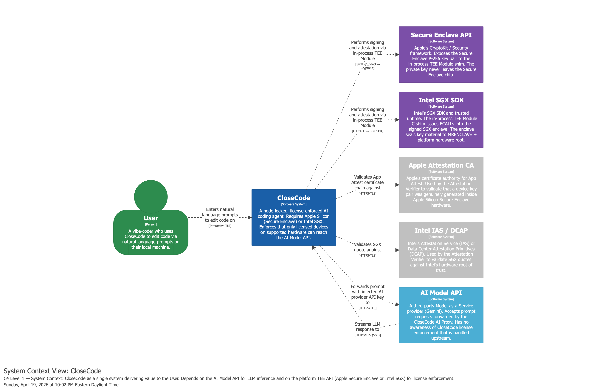
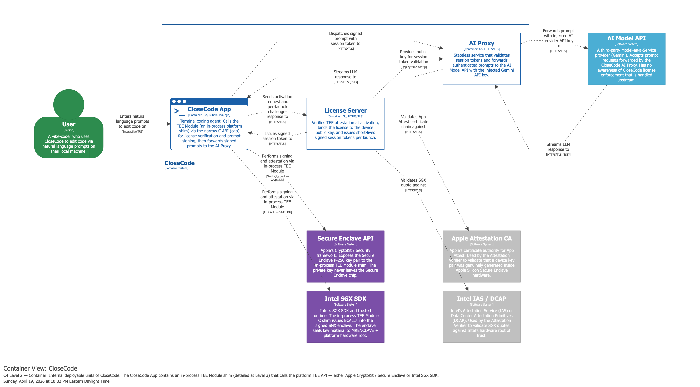
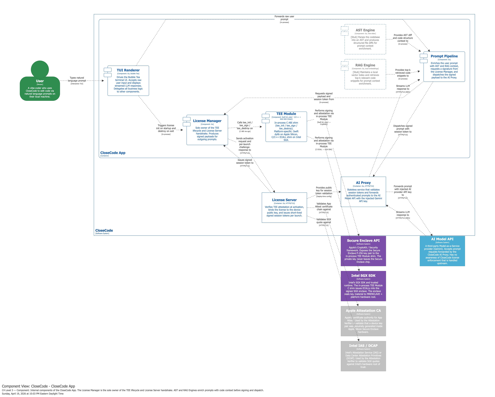
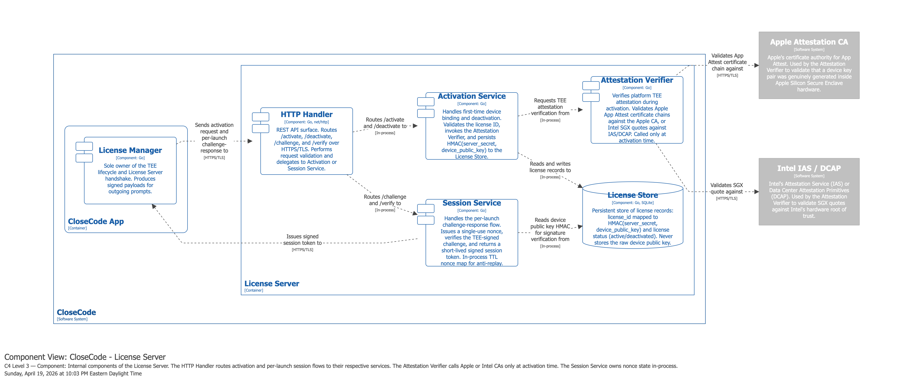
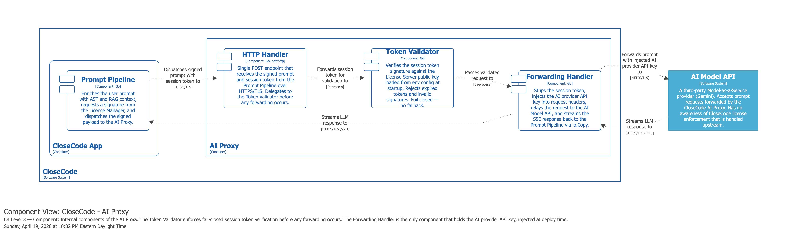
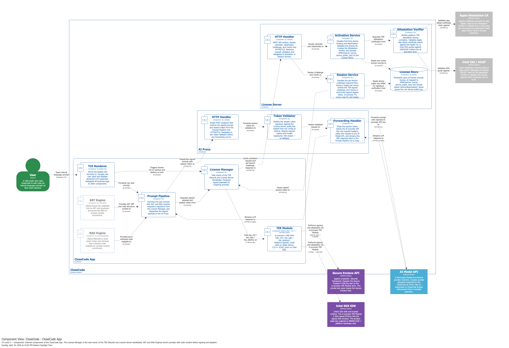
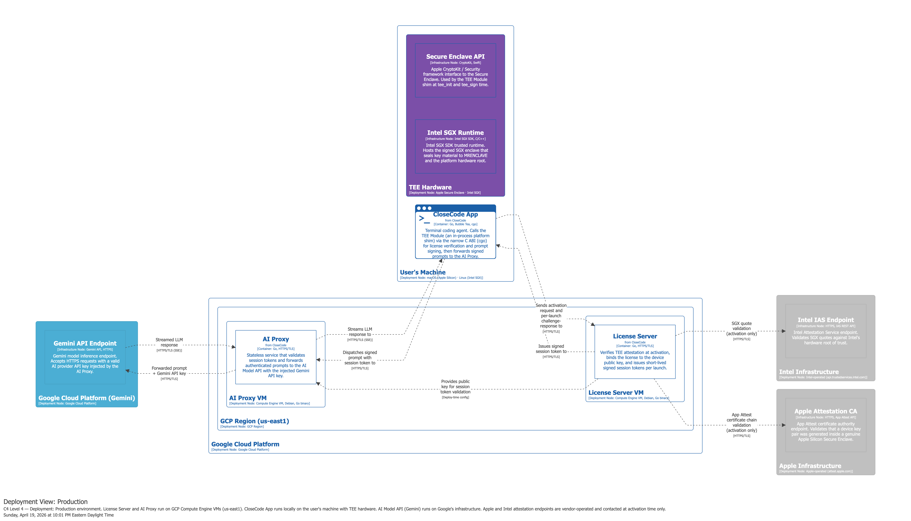

# Checkpoint 1: CloseCode — Software License Server Immune to Software and Microarchitectural Attacks <!-- omit from toc -->

- **Team:** Null and Void
  - Pablo Ordorica Wiener ([@pablordoricaw](www.github.com/pablordoricaw))
- **Semester:** Spring 2026
- **Instructor:** Simha Sethumadhavan
- **TA:** Ryan Piersma

## Table of Contents <!-- omit from toc -->

- [Introduction](#introduction)
- [System Architecture](#system-architecture)
- [Threat Model](#threat-model)
- [Project Plan](#project-plan)
- [Artifact List](#artifact-list)
- [References](#references)

## Introduction

CloseCode is a terminal-based AI coding agent application. In this style of system, the user stays in a command-line interface, describes a software engineering task in natural language, and the agent reads project context, prepares a prompt, sends the request to a model provider, and streams code-oriented output back into the terminal. The interaction model is intentionally lightweight and developer-centric: rather than working inside a chat website, the user works directly from a local repository and iterates in a tight prompt-edit-run loop.

This project is inspired by both commercial and open-source AI coding agents. Anthropic's Claude Code is a well-known example of a terminal-native coding agent experience, while Open Code is an open-source riff on the same interaction model. CloseCode takes that basic product shape and explores a different systems question: how can a terminal AI coding agent enforce licensing even when the client machine is attacker-controlled?

The core idea behind CloseCode is to treat the client operating system as untrusted and bind the license to hardware-backed cryptographic identity rather than to mutable software identifiers. Instead of trusting a normal application process to prove that it is licensed, CloseCode uses a Trusted Execution Environment (TEE), specifically Apple Secure Enclave first and Intel SGX later, to hold a device private key that should be non-exportable. The License Server verifies attestation at activation time, uses fresh nonces during launch-time challenge-response, and issues short-lived session tokens that the AI Proxy validates before forwarding requests to the upstream model provider.

This security-first design is motivated by the threat model for modern AI coding tools. Because these tools provide direct access to a paid model endpoint and run on the attacker's own hardware, they are natural targets for patching, replay, token theft, API key extraction, and microarchitectural attacks against normal-world memory. CloseCode therefore combines a TEE-backed device identity, a minimal always-online License Server, and an AI Proxy that keeps the upstream provider key off the client altogether. The result is a project that is simultaneously about licensing, systems architecture, and hardware-assisted security.

## System Architecture

> [!NOTE]
> I used the C4 model to model the architecture for CloseCode and generate the diagrams in this section. The C4 model is a simple architectural modeling technique developed by Simon Brown that has 4 hierarchical levels of abstractions to create a map of the design. Each level of abstraction "zooms-in" or "zooms-out" the level of detail. These abstractions are:
>
> 1. Context: Highest level of abstraction composed of software systems that deliver value to users independently.
> 2. Container: (Not a Docker container) A container represents a piece of software in a software system that needs to be running in order for the overall system to work. Think of an application or a data store that is independently deployable.
> 3. Component: A component is a grouping of related functionality encapsulated behind a well-defined interface.
> 4. Code: Classes, functions, enums, etc.
>
> The architecture model is defined as code in [docs/architecture/workspace.dsl](./architecture/workspace.dsl) using the DSL of the [Structurizr](https://docs.structurizr.com/) and diagrams were generated using the [Structurizr Playground](https://playground.structurizr.com/)
I modeled the architecture of CloseCode down to the Component level of the C4 model for which the next sections have the corresponding diagrams. Additionally, I also created a deployment diagram to illustrate how the containers of CloseCode will be deployed.

### Level: Context Diagram

First off is the Context level diagram.



### Level: Container Diagram



### Level: Component Diagrams

#### ClodeCode App Component Diagram



#### License Server Component Diagram



#### AI Proxy Component Diagram



#### All Components Diagram



### Deployment Diagram



## Threat Model

### Trust Boundary Summary

| Component | Trust Level | Notes |
| :--- | :--- | :--- |
| CloseCode App code outside TEE | Untrusted | Runs on an attacker-controlled client OS; subject to debugging, patching, and memory inspection |
| TEE Module + Secure Enclave / SGX enclave | Conditionally trusted | Trusted only to the extent that vendor TEE guarantees hold; private key is intended to remain non-exportable |
| Client OS and kernel | Untrusted | Attacker is assumed to have root/administrator access |
| Client RAM outside TEE | Untrusted | Subject to memory scraping, Rowhammer-style corruption, and side-channel observation |
| License Server | Trusted | Operated by the developer; validates attestation and issues signed session tokens |
| License Store | Trusted | Stores only HMAC(server_secret, device_public_key) and license status, never raw private keys |
| AI Proxy | Trusted | Enforces token validation before forwarding and holds the live AI provider API key in process memory |
| AI Model API | Trusted | Third-party LLM provider; receives only requests forwarded through the AI Proxy |
| Network channel (App ↔ License Server) | Semi-trusted | Protected by TLS; still exposed to interception, replay, and availability attacks if implemented incorrectly |
| Network channel (App ↔ AI Proxy) | Semi-trusted | Protected by TLS; session token must be validated server-side on every request |
| Network channel (License Server ↔ Apple / Intel attestation endpoints) | Semi-trusted | Protected by TLS plus pinned vendor root certificates; activation depends on external CA availability |

### Trust Boundary Notes

- The **primary trust anchor on the client** is the TEE-generated private key and the TEE's
  ability to sign a fresh challenge without exposing that private key to normal-world code.
- The **client operating system is explicitly untrusted**. CloseCode is designed under the
  assumption that root access on the client does **not** imply access to TEE-protected keys.
- The **AI Proxy is trusted for policy enforcement and API key custody**, but is intentionally a
  minimal service so that compromise of its logic surface is harder than compromise of a large
  multi-purpose backend.
- The **License Server is a stronger trust boundary than the client**, but its availability is a
  single point of failure because the system is fail-closed and always online.

### 3. Attacker Model

#### 3.1 Attacker Goals

The attacker is assumed to be financially motivated and attempts to obtain continued access to
CloseCode without purchasing or maintaining a valid license. Concretely, the attacker may try to:

- Run CloseCode without a valid license
- Replay a valid activation or session token on another machine
- Patch the client to skip license enforcement or forge a successful verification result
- Extract secret material from client RAM or proxy RAM
- Impersonate a valid TEE-backed device during activation or per-launch verification
- Intercept, modify, or replay traffic between the App and the License Server / AI Proxy
- Cause denial of service to lock out legitimate users

#### 3.2 Attacker Capabilities

The baseline attacker is strong on the client side but not omnipotent:

- Has root/administrator access to the client machine
- Can attach a debugger (`gdb`, `lldb`) or use binary patching and instrumentation tools
- Can read and write arbitrary normal-world process memory on the client
- Can attempt physical-memory corruption or disturbance attacks such as Rowhammer
- Can observe cache timing side channels such as Flush+Reload or Prime+Probe against normal-world code
- Can intercept, drop, delay, or replay network traffic between client and server components
- Can script repeated requests to probe edge cases in activation, nonce handling, and token validation
- Cannot compromise the License Server, AI Proxy, Apple Attestation CA, Intel IAS/DCAP, or AI Model API directly
- Cannot break standard cryptographic primitives such as SHA-256, HMAC-SHA256, ECDSA, or Ed25519
- Cannot directly extract private keys from a correctly functioning Secure Enclave or SGX enclave

#### 3.3 Out of Scope

The following are explicitly out of scope for this threat model:

- Physical invasive attacks on TEE hardware (decapping, fault injection against the chip package,
  invasive probing, JTAG on protected internals)
- Vulnerabilities in vendor TEE firmware, Secure Enclave firmware, SGX microcode, or the vendor
  attestation root itself
- Insider threats or social engineering attacks against the developer or hosting provider
- Direct compromise of the License Server infrastructure, AI Proxy infrastructure, or AI Model API
- Denial-of-service mitigation beyond documenting the risk; the project is fail-closed and does not
  attempt high-availability engineering
- Abuse of the LLM output itself (prompt injection into generated code, model hallucinations)
  except where it affects license enforcement

### 4. STRIDE Threat Analysis

Status values used below:

- **Mitigated** — the architecture directly addresses the threat with a concrete control
- **Partial** — the threat is reduced but not fully eliminated
- **Unmitigated** — the threat is accepted, out of scope, or only documented

#### 4.1 CloseCode App and TEE Boundary

| STRIDE Category | Threat | Severity | Status |
| :--- | :--- | :--- | :--- |
| Spoofing | Attacker forges a device identity by inventing hardware attributes or cloning another machine's visible system identifiers | Critical | Mitigated |
| Spoofing | Attacker replays a previously captured valid session token from the same or another machine | High | Partial |
| Tampering | Attacker patches the App to skip `tee_init()` or to fake a successful license verification result locally | Critical | Mitigated |
| Tampering | Attacker modifies prompt content after signing but before dispatch to the AI Proxy | High | Mitigated |
| Repudiation | Attacker denies having used a specific activation or verification flow | Low | Partial |
| Information Disclosure | Attacker dumps normal-world client RAM to recover the TEE private key | Critical | Mitigated |
| Information Disclosure | Attacker extracts signed payloads, session tokens, or prompt data from normal-world client RAM | High | Partial |
| Denial of Service | Attacker disables the local TEE path or prevents the App from reaching required servers, causing the App to fail closed | Medium | Unmitigated |
| Elevation of Privilege | Control-flow hijack in normal-world code attempts to bypass license enforcement and gain access to the AI Proxy | Critical | Mitigated |

**Rationale and mitigations:**

- Device identity spoofing through MAC address / serial cloning is mitigated because CloseCode no
  longer uses fuzzy hardware fingerprints; it binds the license to a TEE-generated public key and
  activation-time platform attestation.
- Local patching of normal-world code is mitigated because the AI Proxy ultimately requires a valid
  session token and the License Server only issues that token after challenge-response using the
  TEE-backed private key. Patching the UI cannot synthesize the cryptographic proof.
- Prompt tampering after signing is mitigated by the Prompt Pipeline design: AST/RAG enrichment
  happens before signing, and the signed payload is what gets sent onward.
- Disclosure of prompt data and session tokens from normal-world memory remains only **partially**
  mitigated; the TEE protects the device private key, not all application data. A root attacker may
  still read transient prompt material or live session tokens from client RAM.

#### 4.2 License Server

| STRIDE Category | Threat | Severity | Status |
| :--- | :--- | :--- | :--- |
| Spoofing | Attacker submits a fake attestation object to activate an untrusted device | Critical | Mitigated |
| Spoofing | Attacker reuses a previously valid activation transcript for a different device | Critical | Mitigated |
| Tampering | Attacker alters activation or verification requests in transit | High | Mitigated |
| Tampering | Attacker reuses or races a nonce to bypass challenge freshness checks | High | Mitigated |
| Repudiation | User denies having activated or deactivated a license on a specific device | Medium | Partial |
| Information Disclosure | Database breach reveals stored device identity material | High | Partial |
| Denial of Service | License Server outage prevents all new sessions because the system is always online and fail-closed | Critical | Unmitigated |
| Elevation of Privilege | Attacker abuses a logic bug to receive session tokens without a valid challenge signature | Critical | Partial |

**Rationale and mitigations:**

- Fake device activation is mitigated by attestation verification against Apple App Attest or Intel
  IAS/DCAP, with vendor root CAs pinned in the Attestation Verifier.
- Replay of stale per-launch proofs is mitigated by single-use nonces plus short TTLs and timestamp
  skew bounds in the challenge-response protocol.
- A License Store breach is only **partially** mitigated: it does not expose private keys, because
  only HMAC(server_secret, device_public_key) is stored, but it may still reveal license metadata
  and enable offline analysis of activation records.
- Availability remains unmitigated by design. ADR-0002 explicitly accepts that a License Server
  outage locks out all clients.

#### 4.3 AI Proxy

| STRIDE Category | Threat | Severity | Status |
| :--- | :--- | :--- | :--- |
| Spoofing | Unlicensed client sends requests directly to the AI Proxy without a valid session token | Critical | Mitigated |
| Spoofing | Client reuses an expired or forged session token to impersonate a licensed session | High | Mitigated |
| Tampering | Client attempts to smuggle the session token onward to the AI Model API or alter proxy forwarding semantics | Medium | Mitigated |
| Repudiation | User denies having sent a specific prompt through the AI Proxy | Low | Partial |
| Information Disclosure | Proxy compromise or memory scraping reveals the live AI provider API key | Critical | Partial |
| Information Disclosure | Proxy logs or stores prompt contents unexpectedly | High | Mitigated |
| Denial of Service | Proxy outage prevents all LLM access even for properly licensed users | High | Unmitigated |
| Elevation of Privilege | Logic bug in token validation allows forwarding without successful verification | Critical | Partial |

**Rationale and mitigations:**

- Direct use of the AI Model API is prevented because the API key is never present on the client;
  only the AI Proxy holds it and injects it after session validation.
- Forged or expired tokens are mitigated by signature verification against the License Server public
  key baked into proxy configuration at deploy time.
- Prompt logging is mitigated architecturally: the AI Proxy is intentionally a thin forwarding layer
  that does not parse, persist, or inspect prompt content beyond what is required for forwarding.
- The AI provider API key still exists in proxy process memory during operation, so a sufficiently
  strong compromise of the proxy host would disclose it. This is reduced operationally by keeping
  the service minimal, but not eliminated.

#### 4.4 Network Channels

| STRIDE Category | Threat | Severity | Status |
| :--- | :--- | :--- | :--- |
| Spoofing | Attacker impersonates the License Server or AI Proxy with a rogue TLS endpoint | Critical | Partial |
| Tampering | MITM modifies challenges, tokens, or prompt payloads in transit | High | Mitigated |
| Repudiation | Parties dispute what was sent over the network | Low | Partial |
| Information Disclosure | Network observer reads prompts, tokens, or attestation material in transit | High | Mitigated |
| Denial of Service | Attacker blocks network connectivity to force offline behavior | High | Mitigated |
| Elevation of Privilege | Attacker uses transport-layer manipulation to turn an unlicensed state into a licensed one | Critical | Mitigated |

**Rationale and mitigations:**

- Confidentiality and integrity in transit are mitigated by HTTPS/TLS on all external channels.
- The classic "block network to enter offline mode" attack is mitigated by architecture: CloseCode
  has no offline grace path and simply fails closed when required servers are unreachable.
- Server impersonation is only **partially** mitigated unless certificate pinning is consistently
  deployed on every client-server channel. The architecture assumes TLS, but implementation quality
  determines whether a rogue but publicly trusted certificate could be abused.

#### 4.5 Microarchitectural Threats

| STRIDE Category | Threat | Severity | Status |
| :--- | :--- | :--- | :--- |
| Information Disclosure | Spectre-style speculative execution leaks secrets from normal-world memory | High | Partial |
| Information Disclosure | Cache timing attacks (Flush+Reload, Prime+Probe) recover prompt material or live session tokens from normal-world code paths | High | Partial |
| Information Disclosure | Cross-core / transient execution attacks against the TEE implementation leak enclave-protected material | Critical | Unmitigated |
| Tampering | Rowhammer-style memory corruption flips state in normal-world code or request buffers | High | Partial |
| Information Disclosure | Cold-boot or RAM scraping attacks recover transient client-side or proxy-side secrets | High | Partial |
| Denial of Service | Microarchitectural disturbance crashes the client or corrupts transient state, preventing use | Medium | Unmitigated |

**Rationale and mitigations:**

- These threats motivated the TEE-first design. The highest-value secret — the device private key —
  is intended to remain inside the Secure Enclave or SGX enclave, reducing the impact of attacks on
  normal-world memory.
- However, prompt contents, session tokens, and other transient data still exist outside the TEE,
  so many disclosure and corruption attacks are only **partially** mitigated rather than eliminated.
- Attacks that break the TEE implementation itself are out of scope. If the Secure Enclave or SGX is
  compromised below the application layer, CloseCode's client-side security assumptions no longer hold.


### 5. Residual Risk

After the mitigations above, the following residual risks remain and are explicitly accepted:

1. **Always-online availability dependency**
   - Because CloseCode fails closed and requires live contact with the License Server and AI Proxy,
     outages or network filtering can deny service to legitimate users.
   - This is accepted because offline operation would create a stronger license-bypass path than the
     availability risk it removes.

2. **Prompt and token exposure in normal-world memory**
   - The TEE protects the device private key, but not every application secret. Prompts, AST/RAG
     context, and live session tokens may still exist transiently in untrusted memory on the client.
   - This is accepted because moving the entire application into a TEE is impractical and far beyond
     project scope.

3. **AI provider API key exposure in proxy memory**
   - The AI Proxy must hold the upstream API key in memory to inject it into forwarded requests.
   - This is accepted because the alternative — shipping the API key to the client — would be a much
     weaker design. The residual risk is reduced by keeping the proxy minimal and stateless.

4. **TEE implementation and vendor trust**
   - CloseCode assumes Apple Secure Enclave and Intel SGX provide their documented security
     guarantees, and that vendor attestation roots are trustworthy.
   - This is accepted because a course project cannot defend against firmware- or microcode-level
     compromise of commercial TEEs.

5. **Single-server operational risk**
   - The current architecture does not attempt HA deployment, multi-region failover, or DDoS defense.
   - This is accepted as a deployment limitation rather than a protocol flaw. It should be addressed
     in a production system, but is out of scope for the project.

## Project Plan

CloseCode is implemented in three phases, each ending in a verifiable milestone. Phase 1
delivers a working end-to-end system on Apple Silicon. Phase 2 hardens and validates the
security properties of that system. Phase 3 extends coverage to Intel SGX.

The verification strategy is integrated into each phase rather than deferred to the end.

### Phases

- Phase 1: End-to-End System on Apple Silicon
- Phase 2: Security Validation and Deployment
- Phase 3: Intel SGX Extension

### Milestones


| # | Milestone | Phase | Verifiable Output |
|:--|:---|:---|:---|
| M1 | Go workspace and module scaffold | 1 | `go build ./...` passes across all three modules |
| M2 | License Server core (activation + session) | 1 | Integration test: activate, challenge, verify |
| M3 | AI Proxy core (token validation + forwarding) | 1 | Integration test: valid token forwarded, invalid rejected |
| M4 | Apple Secure Enclave TEE Module | 1 | Unit test: tee_init, tee_sign, tee_destroy against real Secure Enclave |
| M5 | CloseCode App TUI — happy path | 1 | Manual: full activation → prompt → LLM response end-to-end on Apple Silicon |
| M6 | Apple Attestation CA verification | 1 | Integration test: activation rejected without valid App Attest attestation |
| M7 | Security validation — Apple Silicon | 2 | All security validation tests pass (see Phase 2) |
| M8 | Demo script and deployment | 2 | Live GCP deployment; smoke test passes; demo recorded |
| M9 | Intel SGX TEE Module | 3 | Unit test: tee_init, tee_sign, tee_destroy inside SGX enclave |
| M10 | Intel IAS verification + end-to-end SGX | 3 | Full activation → prompt → LLM response end-to-end on SGX hardware |

## Artifact List

This repository with three Go applications:

- CloseCode terminal app.,
- License server, and
- AI proxy

Also,

- The IaC using Pulumi IaC with Pulumi Go SDK to deploy the infrastructure for the license server and AI proxy on Google Cloud.
- Architectural and security documentation.

Here's the target repository structure with the above artifacts:

```
comse6424-hw-security-project/
├── cmd/
│   ├── closecode/          # CloseCode App entrypoint (Go)
│   ├── license-server/     # License Server entrypoint (Go)
│   └── ai-proxy/           # AI Proxy entrypoint (Go)
├── internal/
│   ├── shared/             # Shared types: token schema, error codes, request/response structs
│   ├── tee/                # TEE Module C ABI shim and platform backends
│   │   ├── apple/          # Swift @_cdecl Secure Enclave backend
│   │   └── sgx/            # C/C++ ECALL SGX enclave backend (Phase 3)
│   ├── license/            # License Manager logic
│   ├── prompt/             # Prompt Pipeline, AST Engine stub, RAG Engine stub
│   ├── server/             # License Server: HTTP Handler, Activation, Session, Attestation, Store
│   └── proxy/              # AI Proxy: HTTP Handler, Token Validator, Forwarding Handler
├── tee/
│   ├── apple/              # Xcode project / Swift package for Secure Enclave dylib
│   └── sgx/                # SGX enclave project (Phase 3)
├── infra/
│   ├── Pulumi.yaml         # Pulumi project definition
│   ├── Pulumi.dev.yaml     # Stack config (example)
│   └── main.go             # Pulumi Go program: GCP VMs, firewall rules, instance metadata
├── docs/
│   ├── adr/                # Architecture Decision Records
│   ├── architecture/       # Structurizr DSL workspace
│   ├── PLAN.md             # This file
│   ├── THREAT_MODEL.md     # STRIDE threat model
│   └── DEMO_SCRIPT.md      # Demo walkthrough (written in Phase 2)
├── scripts/                # Scripts to aid in development
├── go.work                 # Go workspace: closecode, license-server, ai-proxy, infra modules
└── Makefile                # Top-level build, test, lint, and deploy targets
```

## References

1. Simon Brown. *The C4 model for visualising software architecture.* https://c4model.com/
2. Simon Brown. *Structurizr documentation.* https://docs.structurizr.com/
3. Structurizr Playground. https://playground.structurizr.com/
4. Anthropic. *Claude Code overview / documentation.* https://docs.anthropic.com/
5. Open Code project repository. https://github.com/sst/opencode
6. Microsoft. *The STRIDE Threat Model.* https://learn.microsoft.com/en-us/azure/security/develop/threat-modeling-tool-threats
7. NIST. *Secure Hash Standard (SHS), FIPS 180-4.* https://csrc.nist.gov/pubs/fips/180-4/upd1/final
8. NIST. *Recommendation for Keyed-Hash Message Authentication Codes (HMAC), FIPS 198-1.* https://csrc.nist.gov/pubs/fips/198-1/final
9. NIST. *Digital Signature Standard (DSS), FIPS 186-5.* https://csrc.nist.gov/pubs/fips/186-5/final
10. Apple Developer Documentation. *App Attest.* https://developer.apple.com/documentation/devicecheck/establishing_your_app_s_integrity
11. Apple Developer Documentation. *Protecting keys with the Secure Enclave.* https://developer.apple.com/documentation/security/protecting_keys_with_the_secure_enclave
12. Intel. *Intel Software Guard Extensions (Intel SGX).* https://www.intel.com/content/www/us/en/developer/tools/software-guard-extensions/overview.html
13. Pulumi. *Pulumi Go SDK / GCP provider documentation.* https://www.pulumi.com/docs/
14. Martin Fowler. *Architecture Decision Records.* https://martinfowler.com/articles/adr.html
