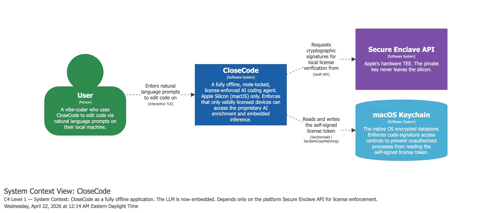
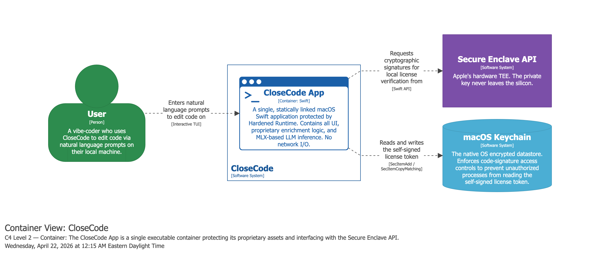
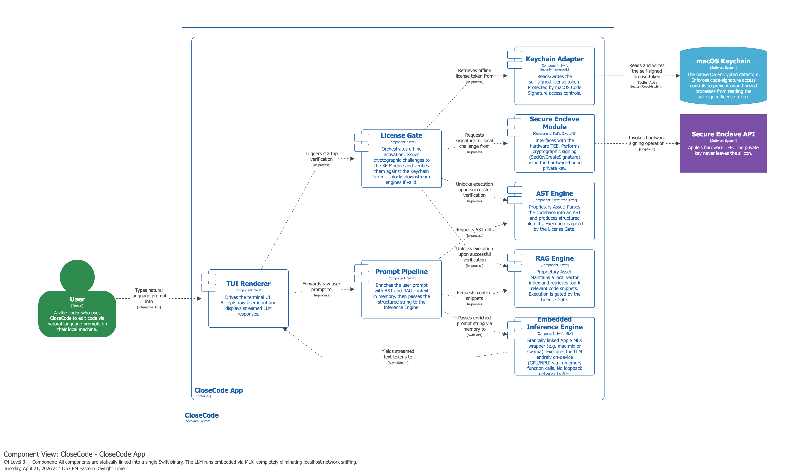

# Checkpoint 1: CloseCode a Licensed Software Application Immune to Software and Microarchitectural Attacks <!-- omit from toc -->

> [!NOTE]
> Renamed the project type from _Software License Server Immune to Software and Microarchitectural Attacks_ to _Licensed Software Application Immune to Software and Microarchitectural Attacks_ to avoid generating confusion due to the ubiquity of web client-server applications since CloseCode is purely an application.

- **Team:** Null and Void
  - Pablo Ordorica Wiener ([@pablordoricaw](www.github.com/pablordoricaw))
- **Semester:** Spring 2026
- **Instructor:** Simha Sethumadhavan
- **TA:** Ryan Piersma

## Table of Contents <!-- omit from toc -->

- [Introduction](#introduction)
- [System Architecture](#system-architecture)
- [Threat Model](#threat-model)
- [Project Plan](#project-plan)
- [Artifact List](#artifact-list)
- [References](#references)

## Introduction

CloseCode is a terminal-based AI coding agent application designed to run entirely on a user's local machine. The user stays in a command-line interface, describes a software engineering task in natural language, and the agent analyzes the local repository, enriches the prompt with code-aware context, runs a local large language model, and streams code-oriented output back into the terminal. The interaction model is intentionally lightweight and developer-centric: instead of working through a web chat interface or cloud-hosted assistant, the user works directly from a local repository in a tight prompt-edit-run loop.

This project is inspired by both commercial and open-source AI coding agents. Systems such as Claude Code popularized the terminal-native coding-agent experience, while open-source projects showed that much of the interaction model can be reproduced locally. CloseCode takes that basic product shape and explores a different systems question: how can a terminal AI coding agent enforce licensing when it must operate fully offline on an attacker-controlled machine?

The core idea behind CloseCode is to avoid any dependence on an always-online license server or AI proxy (previous design) and instead bind license enforcement directly to the local hardware root of trust. CloseCode targets macOS on Apple Silicon and uses the Secure Enclave, together with the macOS Keychain, to protect license state and to gate access to the application's proprietary prompt-enrichment functionality. Rather than treating licensing as a simple boolean check in software, the design ties access to encrypted proprietary assets to successful hardware-backed key release, so that bypassing a control-flow check alone is not sufficient to reach the protected functionality.

## System Architecture

> [!NOTE]
> I used the C4 model to model the architecture for CloseCode and generate the diagrams in this section. The C4 model is a simple architectural modeling technique developed by Simon Brown that has 4 hierarchical levels of abstractions to create a map of the design. Each level of abstraction "zooms-in" or "zooms-out" the level of detail. These abstractions are:
>
> 1. Context: Highest level of abstraction composed of software systems that deliver value to users independently.
> 2. Container: (Not a Docker container) A container represents a piece of software in a software system that needs to be running in order for the overall system to work. Think of an application or a data store that is independently deployable.
> 3. Component: A component is a grouping of related functionality encapsulated behind a well-defined interface.
> 4. Code: Classes, functions, enums, etc.
>
> The architecture model is defined as code in [docs/architecture/workspace.dsl](./architecture/workspace.dsl) using the DSL of the [Structurizr](https://docs.structurizr.com/) and diagrams were generated using the [Structurizr Playground](https://playground.structurizr.com/)

This section contains the C4 model diagrams of the architecture of CloseCode down to the Component level of the C4 model for which the next sections have the corresponding diagrams.

### Level: Context Diagram

First off is the Context level diagram.



### Level: Container Diagram



### Level: Component Diagram



### Operational Flows

To understand how the components interact securely, the architecture must be viewed across its three primary operational states: Activation, Use, and Expiration.

#### 1. Activation Flow (First Launch)

When the user launches CloseCode for the first time, the application must cryptographically bind the provided license to the specific macOS hardware.

1. **Input:** The user provides a "vendor"-signed `License Certificate` (which contains the proprietary `Master_AES_Key` in plaintext).
2. **Hardware Binding:** The License Gate validates the vendor signature. If valid, it instructs the Secure Enclave Module to generate a new, non-exportable hardware Key Pair.
3. **Key Wrapping:** The License Gate uses the Secure Enclave's newly generated Public Key to encrypt (wrap) the `Master_AES_Key`. This creates the `Wrapped_AES_Key`.
4. **Storage:** The License Gate securely deletes the plaintext `License Certificate` from memory. It constructs a local `License Token` containing the `Wrapped_AES_Key` and passes it to the Keychain Adapter, which stores it in the macOS Keychain under strict Code Signature access controls (`kSecAccessControl`).

#### 2. Use Flow (Daily Execution)

On subsequent launches, the application must securely unwrap the key to unlock the proprietary engines.

1. **Retrieval:** The TUI Renderer triggers the startup sequence. The License Gate asks the Keychain Adapter to retrieve the `License Token`.
2. **Hardware Unwrapping:** The License Gate extracts the `Wrapped_AES_Key` and passes it to the Secure Enclave Module. The Secure Enclave uses its burned-in Private Key to decrypt the payload, returning the plaintext `Master_AES_Key` to the License Gate in memory.
3. **Engine Initialization:** The License Gate passes the `Master_AES_Key` to the AST and RAG Engines. The engines use this key to decrypt their proprietary rulesets and embeddings from the local filesystem into RAM.
4. **Prompt Processing:** As the user types, the Prompt Pipeline queries the unlocked AST and RAG engines to build the `Enriched Prompt`.
5. **Inference:** The `Enriched Prompt` is passed via an in-memory Swift function call to the Embedded Inference Engine (MLX), which executes the LLM locally and streams the text response back to the TUI Renderer.

When the application exits or the session is terminated, CloseCode must ensure no cryptographic material or proprietary logic is left exposed.

1. **Memory Zeroization:** The License Gate and Proprietary Engines overwrite the memory addresses holding the plaintext `Master_AES_Key`, the decrypted AST rulesets, and the decrypted RAG embeddings with zeros before the process terminates.
2. **State Persistence:** The `License Token` remains securely at rest in the macOS Keychain, and the encrypted asset blobs remain untouched on the filesystem, ready for the next secure launch.

#### 3. Expiration Flow

Because CloseCode operates entirely offline, license expiration must be enforced locally without relying on a remote time-server or license server to revoke access.

1. **Validation Check:** During the Use Flow (at launch), the License Gate reads the `License Token` from the macOS Keychain. Before attempting any cryptographic operations, it parses the `expiration_date` embedded within the token.
2. **Integrity Verification:** To ensure the Tier 1 attacker hasn't simply modified the `expiration_date` in the token, the License Gate verifies the cryptographic signature over the token's metadata. If the date was tampered with, the signature check fails immediately.
3. **Time Comparison:** The License Gate compares the verified `expiration_date` against the local macOS system clock (and the Secure Enclave's monotonic anti-rollback counter, if utilized).
4. **Enforcement:** If the current time is past the expiration date, the License Gate intentionally halts the flow. It refuses to pass the `Wrapped_AES_Key` to the Secure Enclave Module.
5. **Lockout:** Because the hardware decryption never occurs, the `Master_AES_Key` is never recovered. The AST and RAG engines remain securely encrypted on disk, the application gracefully fails closed, and the user is prompted in the TUI to input a new, valid License Certificate.

## Threat Model

### Assets

CloseCode has three types of assets that it protects:

#### Functional Assets

These represent the value the CloseCode application delivers to users and should only be accessible to license-holding users.

| Asset                                     | Confidentiality                                        | Integrity                                                         | Availability                              |
| ----------------------------------------- | ------------------------------------------------------ | ----------------------------------------------------------------- | ----------------------------------------- |
| Proprietary functionality that enriches users prompt |  Only licensed users should be able to invoke it; the implementation itself should not be directly inspectable or extractable                 |  Must not be tampered with to produce incorrect enrichment       |  Must be available when license is valid |
| Enriched prompt content                   |  Must not be observable by unauthorized processes or via microarchitectural side channels |  Must not be tampered with between enrichment and LLM submission | -                                         |

#### License Mechanism Assets

These are the assets the license enforcement mechanism depends on. The compromise of any of them would either allow unlicensed access to the proprietary functionality or break the mechanism entirely.

| Asset                                                     | Confidentiality                        | Integrity                                                     | Availability                                      |
| --------------------------------------------------------- | -------------------------------------- | ------------------------------------------------------------- | ------------------------------------------------- |
| License credential                                        | -                                      |  Must not be forgeable or transferable beyond its terms      |  Must be readable at launch                      |
| License expiration                                        | -                                      |  Must not be modifiable by the user                          | -                                                 |
| Keys / tokens generated by the license checking mechanism |  Key material must not be extractable |  Must not be substitutable with attacker-controlled material | -                                                 |
| The license checking mechanism itself                     | -                                      |  Must not be bypassable, patchable, or redirectable. The verification logic must run to completion          |  Must run on every launch before granting access |
| The license gate | - | Must not be bypassable | Must not be bypassable via control flow manipulation or speculative execution. The gate result must be the sole condition for reaching functional assets |

### Attacker Model

Modeled two personas who would be motivated to attack CloseCode. They share a common permission
baseline: they hold a valid license for a single device and have root access to their macOS machine.
Neither can tamper with Secure Enclave hardware or its firmware.

#### Motivated Competitor (primary design target)

**Profile:** A developer building a competing AI coding agent who has legitimately purchased
a CloseCode license to study the product.

**Motivation:** Extract or replicate CloseCode's proprietary prompt-enrichment logic to
incorporate it into their own product.

**Capabilities:**
- Root access on the licensed machine
- General software development skills, including use of AI-assisted tooling
- Can inspect running process state using standard developer tools (Xcode Instruments,
  `lldb`, `dtrace`)
- Can observe filesystem and Keychain layout
- Can attempt to copy or transfer license artifacts to another machine

**Limits:**
- Cannot perform static binary analysis or disassemble compiled binaries
- Cannot perform dynamic binary instrumentation (no Frida, no manual hook injection)
- Cannot exploit microarchitectural side channels
- Cannot modify signed binaries without triggering Gatekeeper/codesign validation failures

**Design target:** The system must fully mitigate all attacks within this persona's capability
envelope. This is the realistic threat profile: motivated, resourceful, but not a security
specialist.

#### Security Researcher (document and partially mitigate)

**Profile:** A security researcher who has acquired a CloseCode license and is actively
probing the system for vulnerabilities with the intention of either for responsible disclosure,
academic publication, or competitive intelligence.

**Motivation:** Discover bypassable license controls, extract key material, or demonstrate
that the proprietary functionality is reachable without a valid license.

**Capabilities:**
- Everything in the Motivated Competitor, plus:
- Static binary analysis and disassembly (`otool`, `Hopper`, `Ghidra`, IDA Pro)
- Dynamic binary instrumentation (Frida, `lldb` scripting, custom dylib injection)
- Memory forensics (heap inspection, `/proc`-equivalent tools, core dumps)
- Microarchitectural side-channel attacks (cache timing, speculative execution leakage)
- SIP disabled on the target machine (enables unsigned kernel extensions, unrestricted
  `dtrace`, direct memory access)
- Control flow manipulation (NOP patching, return address overwrite, `DYLD_INSERT_LIBRARIES`
  with SIP off)

**Limits:**
- Cannot break Secure Enclave cryptographic guarantees (no known attack on SE hardware)
- Cannot forge a valid CryptoKit signature without access to the SE-bound private key
- Cannot compromise the vendor Secure Enclave firmware (explicitly out of scope per
  Section 1)
- Assumed to have no persistent kernel exploit (e.g., no jailbreak-equivalent for macOS)

**Design target:** The system documents known attack paths within this persona's capability
envelope and implements mitigations where feasible. Residual risks are accepted and
recorded in the threat model.

### Data Flow Analysis

This section documents the Data flow analysis on the C4 component level model of the architecture.

#### Entities, Processes, and Datastores

**External Entities (Interactors)**
*   **User:** The user interacting with the application. They may correspond to one of the attacker personas in Section 3.
*   **Secure Enclave API:** Apple's hardware coprocessor interface (`CryptoKit`). It is strictly external to the application process.

**Datastores**
*   **macOS Keychain:** The OS-managed SQLite database (`~/Library/Keychains/`). Stores the `License Token` at rest. It enforces macOS Code Signature access controls (`kSecAccessControl`).
*   **Local File System:** The disk where the proprietary AST rulesets and RAG vector embeddings are stored at rest in an encrypted state.

**Processes (Internal to CloseCode App Container)**
*   **TUI Renderer:** Routes I/O between the User and the application logic.
*   **Keychain Adapter:** Interfaces with macOS Security APIs to read the `License Token`.
*   **Secure Enclave Module:** Proxies the hardware decryption request to the Secure Enclave API.
*   **License Gate:** The orchestrator. Unwraps the `Master_AES_Key` and securely distributes it to the proprietary engines.
*   **AST Engine:** Parses codebase into structured diffs. Requires the `Master_AES_Key` to initialize.
*   **RAG Engine:** Retrieves vector context. Requires the `Master_AES_Key` to initialize.
*   **Prompt Pipeline:** Assembles the `Raw Prompt`, `AST Diffs`, and `Vector Snippets` into the final `Enriched Prompt`.
*   **Inference Engine:** Embedded local inference runtime executing LLM generation entirely on-device. Implemented using an existing integrated inference engine such as llama.cpp, Swama, or macMLX..

#### Trust Boundaries

Threats manifest when data crosses boundaries where the level of trust, privilege, or isolation changes.

1. **The OS / Application Boundary:** Separates the CloseCode application's protected memory space from the rest of macOS.
    *   *Defense:* Code Signing, macOS Hardened Runtime.
    *   *Attacker capability:* Persona 1 (root user) is bounded *outside* TB1. Persona 2 (researcher) can pierce TB1 by disabling System Integrity Protection (SIP) and attaching a debugger.
2. **TB2: The Hardware / OS Boundary:** Separates the main CPU and macOS from the Secure Enclave coprocessor.
    *   *Defense:* Apple Silicon Hardware Isolation.
    *   *Attacker capability:* Neither persona 1 nor persona 2 can pierce this boundary. It is absolutely trusted.
3. **TB3: The Cryptographic Boundary (In-Memory):** Separates encrypted assets (on disk/Keychain) from plaintext keys and algorithms in RAM.
    *   *Defense:* AES-256 decryption, strictly contingent on the hardware unlock over TB2.

#### Data Flows

The following flows map the movement of data between the entities defined above. These flows form the attack surface for the STRIDE analysis in Section 5.

| Flow ID | Source → Destination | Data Carried | Trust Boundary Crossed |
| :--- | :--- | :--- | :--- |
| **DF1** | User → TUI Renderer | `Raw Prompt` | Yes (TB1) |
| **DF2** | macOS Keychain → Keychain Adapter | `License Token` (contains `Wrapped_AES_Key`) | Yes (TB1) |
| **DF3** | Keychain Adapter → License Gate | `Wrapped_AES_Key` | No (Internal) |
| **DF4** | License Gate → SE Module | `Wrapped_AES_Key` | No (Internal) |
| **DF5** | SE Module → Secure Enclave API | `Wrapped_AES_Key` | Yes (TB2) |
| **DF6** | Secure Enclave API → SE Module | Plaintext `Master_AES_Key` | Yes (TB2) |
| **DF7** | SE Module → License Gate | Plaintext `Master_AES_Key` | No (Internal) |
| **DF8** | License Gate → AST / RAG Engines | Plaintext `Master_AES_Key` | No (Internal) |
| **DF9** | Local File System → AST / RAG Engines | Encrypted Rulesets / Embeddings | Yes (TB1) |
| **DF10** | TUI Renderer → Prompt Pipeline | `Raw Prompt` | No (Internal) |
| **DF11** | Prompt Pipeline ↔ AST / RAG Engines | Request context / Receive `AST Diffs` & `Snippets` | No (Internal) |
| **DF12** | Prompt Pipeline → Inference Engine | `Enriched Prompt` | No (Internal) |
| **DF13** | Inference Engine → TUI Renderer | `LLM Response Stream` | No (Internal) |
| **DF14** | TUI Renderer → User | `LLM Response Stream` | Yes (TB1) |


### Threat Analysis

This section classifies threats against CloseCode elements using Microsoft's STRIDE framework, documents the mitigations and remaining exposure for each threat category.

Because CloseCode is a fully offline system, the most important attack surfaces are local trust boundaries:

- the OS / application boundary,
- the application / Secure Enclave boundary, and
- the in-memory cryptographic boundary where encrypted assets become plaintext.

#### Spoofing

Spoofing threats in CloseCode center on whether an attacker can impersonate a trusted identity or trusted execution source, especially the Secure Enclave or a valid license token.

1. **Threat: spoofing the Secure Enclave response on DF6.**
  An attacker attempts to convince the License Gate that a valid `Master_AES_Key` was produced by the Secure Enclave when it was not. This would allow the AST and RAG engines to unlock without legitimate hardware participation.

  - **Motivated Competitor:** Fully mitigated. This persona cannot instrument binaries, inject hooks, or replace CryptoKit calls, so they cannot impersonate the Secure Enclave interface. They are also bounded by TB2, which is assumed trusted.
  - **Security Researcher:** Partially mitigated. A researcher with SIP disabled and dynamic instrumentation may attempt to hook the Secure Enclave Module and substitute attacker-controlled values before they reach the License Gate. However, they still cannot make the Secure Enclave itself produce a valid unwrap for a foreign device, nor can they break its hardware guarantees.
  - **Mitigations:** All hardware key operations are delegated to Apple's Secure Enclave through CryptoKit / Security.framework; the unwrapping key is device-bound and never exportable; Secure Enclave firmware compromise is explicitly out of scope.
  - **Residual risk:** The security researcher attacker may patch the application to fake success in software, but cannot derive the correct `Master_AES_Key` without actual hardware participation. The result is control-flow bypass only, not successful cryptographic unlock.

- **Threat: spoofing a valid license token on DF2 / DF3.**
  An attacker attempts to substitute an attacker-crafted token or one copied from another machine.

  - **Motivated Competitor:** Fully mitigated. Copying a token to another machine does not help because the embedded `Wrapped_AES_Key` is bound to the original machine's Secure Enclave private key and cannot be unwrapped elsewhere.
  - **Security Researcher:** Partially mitigated. A researcher can inspect token format, copy tokens, and substitute data in the Keychain, but cannot make a substituted token unwrap on a different machine without the matching hardware key.
  - **Mitigations:** License tokens are stored in the macOS Keychain with code-signature-based access controls; the wrapped key is cryptographically bound to one device; the license gate validates token structure before attempting unlock.
  - **Residual risk:** Availability can still be disrupted by deletion or corruption of the token, but successful spoofing of a transferable token is not expected within scope.

#### Tampering

Tampering threats ask whether an attacker can modify code, persistent data, or data in transit in a way that breaks integrity or bypasses enforcement.

- **Threat: tampering with the license token in the Keychain on DF2.**
  An attacker modifies fields such as expiration metadata or replaces the entire token blob.

  - **Motivated Competitor:** Fully mitigated with respect to bypass. This persona can locate Keychain items and observe storage layout, but altering the token does not help because the wrapped key will fail to unwrap or validation will fail before release of the `Master_AES_Key`.
  - **Security Researcher:** Partially mitigated. A researcher can tamper with the token, fuzz the parser, and attempt malformed-token attacks. If parsing or validation code contains implementation bugs, this may expose denial-of-service or parser-level vulnerabilities even though the cryptographic binding still protects against successful forgery.
  - **Mitigations:** Token parsing is narrow and deterministic; cryptographic unlock depends on the Secure Enclave rather than trusted metadata alone; failed unwrap terminates access before reaching functional assets.
  - **Residual risk:** Token tampering is an availability risk and a potential bug-finding vector, but not a realistic license-bypass path by itself.

- **Threat: tampering with encrypted AST rulesets or RAG embeddings on DF9.**
  An attacker modifies the encrypted proprietary assets on disk so that the application initializes altered logic.

  - **Motivated Competitor:** Fully mitigated with respect to extracting proprietary logic, but not necessarily with respect to denial of service. This persona can edit files on disk, yet modified ciphertext should fail decryption or integrity checks and prevent engine initialization.
  - **Security Researcher:** Partially mitigated. A researcher may deliberately mutate ciphertext, target parser bugs after decryption, or attempt fault-oriented corruption to study error handling.
  - **Mitigations:** Proprietary assets are stored encrypted at rest and only decrypted after successful license unlock; initialization should fail closed on malformed or unauthenticated ciphertext; only decrypted in memory after release of the `Master_AES_Key`.
  - **Residual risk:** If the encrypted asset format lacks authenticated encryption or strong integrity verification, tampering may degrade into malformed plaintext rather than clean rejection. This must be addressed in implementation.

- **Threat: tampering with the license checking mechanism or license gate.**
  An attacker attempts to patch control flow so that the application behaves as if the license check passed.

  - **Motivated Competitor:** Fully mitigated under the stated model. This persona cannot patch signed binaries or perform dynamic instrumentation, so they cannot realistically force a fake success path.
  - **Security Researcher:** Partially mitigated. A researcher can patch branch conditions, return values, or call sites. However, the architecture intentionally binds the AST and RAG engines to the release of the `Master_AES_Key` rather than to a boolean result. A forged control-flow success without the cryptographic key does not unlock the proprietary engines.
  - **Mitigations:** Hardened Runtime, code signing, single signed binary, and cryptographic binding of proprietary assets to the Secure Enclave-derived unwrap flow; the Prompt Pipeline alone is not the gate.
  - **Residual risk:** The security researcher can still use patching for program analysis, fault injection, or memory observation after a legitimate unlock, but not to obtain a working unlicensed execution path solely through a boolean bypass.

- **Threat: tampering with the system clock to extend license validity.**
  An attacker attempts to bypass the expiration logic by altering the local system clock backward in time, causing the application to evaluate an expired license as still valid.

  - **Motivated Competitor:** Unmitigated. A root-capable user can disconnect from the network and manually roll back the macOS system clock before launching CloseCode. Because the application relies on the untrusted host OS for the current time, it will successfully unlock.
  - **Security Researcher:** Unmitigated. In addition to clock rollback, a researcher can easily patch the control-flow instruction (e.g., `if currentTime > expirationDate`) to ignore the time check entirely.
  - **Mitigations:** The expiration date itself is cryptographically signed inside the token preventing arbitrary modification of the date metadata, but the *evaluation* of that date relies entirely on untrusted inputs (the OS clock) and bypassable control flow.
  - **Residual risk:** Enforcing time-based expiration in a fully offline, attacker-controlled environment is fundamentally flawed. We explicitly accept that any user can bypass expiration limits by manipulating the local system clock.

#### Repudiation

Repudiation threats concern whether an attacker can deny performing an action because the system lacks sufficient audit evidence.

CloseCode is intentionally fully offline and does not rely on a license server, remote audit log, or central event recorder. Because of this, repudiation is not a primary security goal for the system. There is no requirement to prove later which local user launched the application, which prompts were entered, or whether a failed unlock attempt occurred.

- **Threat: a local attacker denies having tampered with local assets or attempted bypasses.**
  - **Motivated Competitor:** Accepted as out of scope. Local forensics and user attribution are not goals of the system.
  - **Security Researcher:** Accepted as out of scope. The project is about resisting bypass and extraction, not generating evidentiary logs.
  - **Mitigations:** None beyond standard local OS observability.
  - **Residual risk:** No non-repudiation guarantees are provided. This is an explicit tradeoff of the fully offline design.

#### Information Disclosure

Information disclosure is the most important STRIDE category for CloseCode because the main value of the system lies in the proprietary functionality and the resulting enriched prompt.

- **Threat: disclosure of the license token from the macOS Keychain on DF2.**
  An attacker attempts to read the token at rest to reuse or analyze it.

  - **Motivated Competitor:** Fully mitigated to the extent expected by the persona. The Keychain item is protected by macOS access controls tied to the application's code signature, making simple file scraping or alternate-process reads ineffective.
  - **Security Researcher:** Partially mitigated. A researcher with SIP disabled, deep OS tooling, or runtime hooking may be able to observe the token after the application legitimately retrieves it.
  - **Mitigations:** Keychain storage, code-signature-based item access control, narrow adapter interface, and device-bound wrapped key design.
  - **Residual risk:** Reading the token alone is insufficient to transfer the license to another machine because the wrapped key remains hardware-bound.

- **Threat: disclosure of the plaintext `Master_AES_Key` on DF6 / DF7 / DF8.**
  An attacker attempts to read the plaintext key when it is returned from the Secure Enclave and distributed to the proprietary engines.

  - **Motivated Competitor:** Fully mitigated under the model. This persona does not have the binary instrumentation or memory forensics capability needed to capture the transient plaintext key in RAM.
  - **Security Researcher:** Partially mitigated, not eliminated. A researcher with debugger attachment, heap inspection, or core-dump style tooling may capture the key during or after a legitimate unlock if it remains in memory long enough.
  - **Mitigations:** Keep key lifetime short, avoid writing plaintext keys to disk keep unlock and decryption in-process, zeroize buffers when practical, decrypt only what is needed for runtime initialization.
  - **Residual risk:** Once plaintext exists in host memory, a sufficiently capable local attacker can potentially recover it.

- **Threat: disclosure of proprietary AST / RAG logic after decryption.**
  An attacker attempts to dump the proprietary rulesets or embeddings from memory after the license gate successfully unlocks them.

  - **Motivated Competitor:** Fully mitigated under the chosen persona assumptions. This attacker cannot perform memory forensics or binary instrumentation, so moving the assets from static disk form into transient memory is enough to defeat their extraction attempts.
  - **Security Researcher:** Partially mitigated. A researcher can attach runtime tooling after legitimate unlock, dump decrypted memory, and study the rules or embeddings.
  - **Mitigations:** Encrypted-at-rest storage, delayed decryption, in-memory only plaintext handling, single-binary design that removes low-effort interception seams, and no external REST API carrying the enriched prompt.
  - **Residual risk:** The security researcher may still recover decrypted assets from RAM after a legitimate launch. This is documented and accepted as a partial-mitigation case.

- **Threat: disclosure of the enriched prompt on DF12.**
  An attacker attempts to observe the final enriched prompt before it is consumed by the local inference engine.

  - **Motivated Competitor:** Fully mitigated by the architecture. Because inference is embedded in-process rather than sent over a loopback REST API, there is no localhost network traffic to sniff and no plain-text prompt crossing an external boundary.
  - **Security Researcher:** Partially mitigated. A researcher may still dump process memory or instrument the function boundary between the Prompt Pipeline and the Inference Engine.
  - **Mitigations:** Embedded inference engine inside the same binary; no local HTTP server; prompt remains in memory only; Hardened Runtime raises the cost of attaching tooling.
  - **Residual risk:** In-memory disclosure to security researcher remains possible after legitimate execution.

- **Threat: microarchitectural disclosure of enriched prompt or keys.**
  An attacker attempts to infer sensitive in-memory data through cache timing, speculative execution leakage, or related local side channels.

  - **Motivated Competitor:** Fully mitigated by attacker-model definition because this persona cannot exploit microarchitectural side channels.
  - **Security Researcher:** Partially mitigated and explicitly documented. This persona may attempt such attacks, especially once plaintext assets are present in RAM.
  - **Mitigations:** Reduce secret residency time in memory, avoid unnecessary copying, prefer direct in-process handoff, and minimize cross-component buffering.
  - **Residual risk:** Because the platform is a general-purpose processor and the application must manipulate plaintext in RAM to function, microarchitectural leakage cannot be fully eliminated in scope.

#### Denial of Service

Denial-of-service threats ask whether an attacker can prevent licensed use of the application or make functional assets unavailable.

- **Threat: deleting or corrupting the Keychain token or encrypted assets.**
  - **Motivated Competitor:** Possible. A root-capable user can delete local files or Keychain items and render the application unusable on that machine.
  - **Security Researcher:** Also possible, with the same effect.
  - **Mitigations:** Fail closed; provide re-activation or re-import path for the user; validate files before initialization.
  - **Residual risk:** Denial of service by the device owner is not meaningfully preventable in a fully offline local application and is accepted.

- **Threat: blocking or destabilizing Secure Enclave access.**
  - **Motivated Competitor:** Possible only as self-denial, such as corrupting local environment state or terminating the process.
  - **Security Researcher:** Also possible through more aggressive local tooling.
  - **Mitigations:** Fail closed if hardware operations fail; keep startup flow simple and deterministic.
  - **Residual risk:** Availability depends on the integrity of the local OS and hardware environment. This is acceptable for an offline, user-owned endpoint.

- **Threat: resource exhaustion against inference or enrichment.**
  - **Motivated Competitor:** A local user can starve CPU, memory, or GPU resources and make CloseCode slow or unusable.
  - **Security Researcher:** Same.
  - **Mitigations:** Defensive resource limits and robust error handling.
  - **Residual risk:** Local resource starvation by the device owner is inherently difficult to prevent and out of scope as a security failure.

#### Elevation of Privilege

Elevation-of-privilege threats ask whether an attacker can gain access to functionality they should not reach, especially by bypassing the license gate or turning low-integrity inputs into execution authority.

- **Threat: bypassing the license gate through control-flow manipulation.**
  An attacker modifies the program so that a failing license check appears to succeed.

  - **Motivated Competitor:** Fully mitigated under the attacker model. This persona cannot patch binaries, disable code-signing protections, or perform dynamic hook injection.
  - **Security Researcher:** Partially mitigated. A researcher can change branch outcomes or hook return values, but this does not itself release the `Master_AES_Key` or decrypt the AST / RAG assets. The architecture intentionally makes the key, not a boolean, the capability needed to reach the protected functionality.
  - **Mitigations:** Cryptographic binding between successful hardware-backed unlock and proprietary asset availability; Hardened Runtime; code signing; no separate local proxy or dylib seam.
  - **Residual risk:** Once a researcher uses a legitimate license on the intended machine, they may be able to study the running system after unlock. That is a post-authorization extraction problem, not a pre-authorization privilege escalation.

- **Threat: using one licensed device to grant access on another device.**
  An attacker attempts to turn authorization on machine A into authorization on machine B.

  - **Motivated Competitor:** Fully mitigated for the expected attack path of token copying. Copying app artifacts, Keychain data, or encrypted rulesets to another machine does not transfer the ability to unwrap the `Master_AES_Key`.
  - **Security Researcher:** Partially mitigated only in the sense that they can explore alternative implementation bugs. They still cannot make a foreign Secure Enclave unwrap a key bound to another device.
  - **Mitigations:** Device-bound wrapping with the Secure Enclave; offline token stored locally but cryptographically unusable off-device.
  - **Residual risk:** None within the stated attacker model for straightforward token-transfer attacks.

### Residual Risk

In summary the explicitly accepted residual risk from meeting the requirement of a fully offline architecture and acceptable application performance is the following:

#### Pre-Activation License Sharing (Lack of Central Ledger)

Because CloseCode operates fully offline without a License Server, there is no central authority to record when a license has been consumed.
*   **The Risk:** If a legitimate purchaser shares their License Certificate with a second user, both users can independently activate the software on their respective machines. Both machines will generate valid, hardware-bound tokens for their own Secure Enclaves.
*   **Acceptance Rationale:** This is an unavoidable consequence of a fully offline activation model. However, once activated on a machine, the resulting License Token cannot be transferred to a third machine, satisfying the node-locked requirement.

#### Post-Unlock Memory Extraction (Tier 2 Capability)

To function, CloseCode must eventually decrypt its proprietary AST rulesets and RAG embeddings into system RAM, and assemble the Enriched Prompt in plaintext to pass to the local Inference Engine.
*   **The Risk:** A security researcher attacker who legitimately activates the software on their machine can disable System Integrity Protection (SIP), attach a kernel-level debugger or memory forensic tool, and dump the plaintext assets from RAM while the application is running.
*   **Acceptance Rationale:** The Cryptographic Binding mechanism raises the bar for the attacker from static and to dynamic reverse engineering to obtain the IP. If the attacker successfully reverse engineers the functionality, they earned it.

#### Microarchitectural Side Channels

While the Secure Enclave protects the hardware-bound private key from side channels, the main CloseCode application executes on the general-purpose CPU (Apple Silicon) alongside other user processes.
*   **The Risk:** A sophisticated researcher attacker could author a companion process that uses cache-timing attacks or speculative execution exploitation to infer the plaintext `Master_AES_Key` or the Enriched Prompt while CloseCode is actively processing them.
*   **Acceptance Rationale:** Fully mitigating microarchitectural leakage in software often requires disabling optimizations (like caching and speculative execution) or using constant-time algorithms for all operations. This would incur a massive performance penalty, rendering the AI coding agent practically unusable.

#### Local Denial of Service

The architecture relies on the macOS Keychain and local filesystem integrity.
*   **The Risk:** A local root user can delete their `License Token` from the Keychain or corrupt the encrypted AST/RAG files on disk, causing the application to fail closed.
*   **Acceptance Rationale:** A user sabotaging their own endpoint's availability is not a DRM or confidentiality failure. The system correctly prioritizes failing closed (protecting assets) over maintaining availability when state is corrupted.

#### License Expiration Bypass (Lack of Trusted Time Source)

Because CloseCode operates entirely offline, it must rely on the local macOS system clock to determine if a license has expired.
*   **The Risk:** A Motivated Competitor or Security Researcher can manually roll back the host operating system's clock to a date before the license expiration. Because the time comparison check is a software-level evaluation against an untrusted input, the attacker can indefinitely maintain access to the proprietary assets without renewing their license.
*   **Acceptance Rationale:** Enforcing time-bound access on an attacker-controlled, fully offline endpoint is a fundamentally unsolvable problem without a hardware-backed Secure Real-Time Clock (RTC) that the user cannot manipulate. Since macOS does not expose an unalterable hardware clock to user-space applications, we explicitly accept expiration bypass as a necessary trade-off to meet the strict offline-only requirement.

## Project Plan

This project is divided into four sequential phases: implementing the cryptographic foundation, assembling the functional agent, validating the security and performance claims, and finalizing the academic deliverables.

### Phases

**Phase 1: Cryptographic Binding & Core Architecture (April 22 – April 28)**
Establish the secure foundation of the application. This includes writing the Swift modules for the macOS Keychain Adapter, the Secure Enclave CryptoKit interface, and the AES-256 key derivation logic. The goal is to successfully encrypt dummy assets on disk and decrypt them in memory only upon a valid hardware signature.

**Phase 2: Agent Assembly & Embedded Inference (April 29 – May 4)**
This involves building the TUI Renderer, the Prompt Pipeline, integrating the AST and RAG engine stubs, and embedding the local LLM inference engine (e.g., `mac-mlx` or `swama`) directly into the Swift binary.

**Phase 3: Security Validation (May 5 – May 9)**
Test against the Threat Model by simulating expected fully mitigated attacks (token copying, filesystem tampering, unprivileged loopback sniffing) to verify full mitigation.

**Phase 4: Final Reporting & Packaging (May 10 – May 12)**
Write the final report, recording a demonstration video, cleaning up the codebase, and packaging all source code, and tests for submission.

### Milestones

| # | Milestone | Phase | Verifiable Output |
|:--|:---|:---|:---|
| 1 | Cryptographic Pipeline Functional | Phase 1 | A CLI test executable that successfully wraps an AES key with the Secure Enclave and stores it in the Keychain. |
| 2 | License Gate Enforcement | Phase 1 | The application successfully decrypts a test ruleset when a valid token is present and crashes/fails when the token is tampered with or moved to another Mac. |
| 3 | Embedded LLM Streaming | Phase 2 | The Prompt Pipeline passes an enriched string to the embedded MLX engine and streams the text output to the TUI without opening local network ports. |
| 4 | Security Validation Complete | Phase 3 | A test report documenting the failure of Tier 1 attack simulations and capturing the artifacts of a Tier 2 memory dump proof-of-concept. |
| 5 | Artifact Package Ready | Phase 4 | A ZIP/repository containing the final Swift codebase, Hardened Runtime build scripts, documentation, evaluation results. |


## Artifact List

The complete implementation and documentation for the fully offline CloseCode application:

- **CloseCode macOS Application:** A single, statically linked Swift executable protected by the macOS Hardened Runtime.
- **Embedded Inference Engine:** Integration with an Apple MLX-based LLM engine (e.g., `macMLX` or `swama`) running directly on-device.
- **Architectural and Security Documentation:** Including the C4 Structurizr model, ADRs, Threat Model, and the Final Report.
- **Validation Artifacts:** Build scripts (including `codesign` and Hardened Runtime entitlements), automated test suites, and adversarial simulation scripts.
- **Generative AI Logs:** Complete chat logs demonstrating the intentional design and critical reasoning used during the project, as required by the course rubric.

Here is the target repository structure for the final submission:

```text
comse6424-hw-security-project/
├── Package.swift                # Swift Package Manager manifest (dependencies: MLX, ArgumentParser)
├── Sources/
│   ├── CloseCode/               # Main entrypoint for the CLI application
│   ├── TUI/                     # Terminal UI renderer and input handling
│   ├── License/                 # License Gate and Keychain Adapter logic
│   ├── SecureEnclave/           # CryptoKit hardware interface for key wrapping/unwrapping
│   ├── Engines/                 # AST Engine, RAG Engine, and encrypted asset loading
│   ├── Prompt/                  # Prompt Pipeline (context assembly)
│   └── Inference/               # Embedded MLX inference wrapper
├── Tests/
│   ├── LicenseTests/            # Unit tests for cryptographic binding and token parsing
│   └── IntegrationTests/        # Tests for end-to-end decryption and prompt enrichment
├── docs/
│   ├── adr/                     # Architecture Decision Records (0000-0016)
│   ├── architecture/            # Structurizr C4 DSL workspace
│   ├── PLAN.md                  # This project plan
│   ├── THREAT_MODEL.md          # STRIDE threat model and dataflow analysis
│   ├── DEMO_SCRIPT.md           # Step-by-step demo walkthrough
│   └── FINAL_REPORT.pdf         # The final academic report submission
├── scripts/
│   ├── build_and_sign.sh        # Script to compile, apply Hardened Runtime, and codesign
│   ├── generate_dummy_assets.sh # Script to encrypt AST/RAG rulesets with a Master AES Key
│   └── simulate_attack.sh       # Attack scripts to verify OS/Keychain access controls
├── logs/                        # Exported chat logs of AI-assisted development and design
└── Makefile                     # Top-level commands (make build, make test, make sign)
```

## References

1. Simon Brown. *The C4 model for visualising software architecture.* https://c4model.com/
2. Simon Brown. *Structurizr documentation.* https://docs.structurizr.com/
3. Structurizr Playground. https://playground.structurizr.com/
4. Anthropic. *Claude Code overview / documentation.* https://docs.anthropic.com/
5. Open Code project repository. https://github.com/sst/opencode
6. Microsoft. *The STRIDE Threat Model.* https://learn.microsoft.com/en-us/azure/security/develop/threat-modeling-tool-threats
7. NIST. *Secure Hash Standard (SHS), FIPS 180-4.* https://csrc.nist.gov/pubs/fips/180-4/upd1/final
8. NIST. *Recommendation for Keyed-Hash Message Authentication Codes (HMAC), FIPS 198-1.* https://csrc.nist.gov/pubs/fips/198-1/final
9. NIST. *Digital Signature Standard (DSS), FIPS 186-5.* https://csrc.nist.gov/pubs/fips/186-5/final
10. Apple Developer Documentation. *App Attest.* https://developer.apple.com/documentation/devicecheck/establishing_your_app_s_integrity
11. Apple Developer Documentation. *Protecting keys with the Secure Enclave.* https://developer.apple.com/documentation/security/protecting_keys_with_the_secure_enclave
12. Intel. *Intel Software Guard Extensions (Intel SGX).* https://www.intel.com/content/www/us/en/developer/tools/software-guard-extensions/overview.html
13. Martin Fowler. *Architecture Decision Records.* https://martinfowler.com/articles/adr.html
