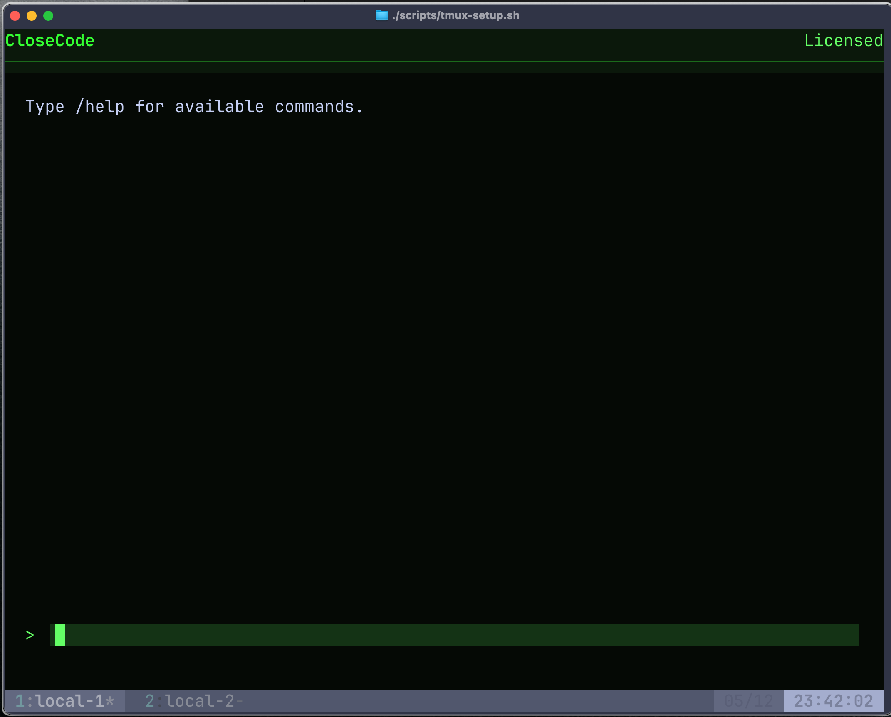
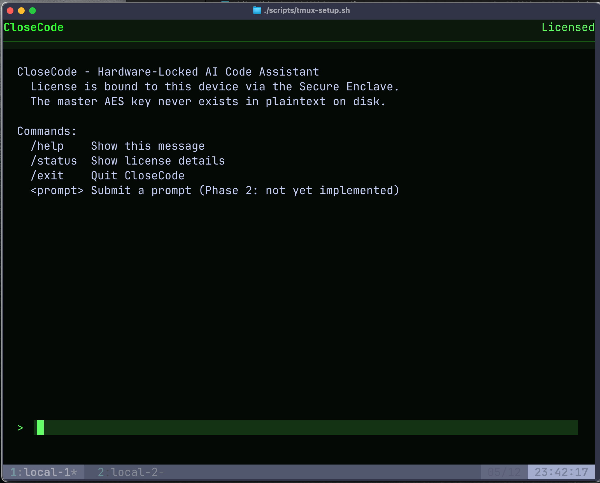
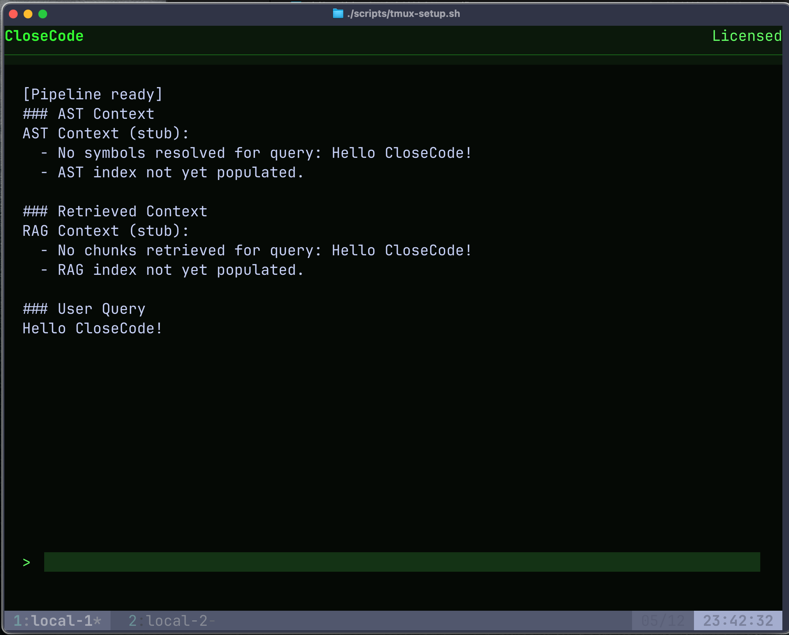

# CloseCode: A Hardware-Bound License Enforcement System for an AI Coding Agent

- **Course:** COMSE-6424 Hardware Security
- **Team:** Null and Void
  - Pablo Ordorica Wiener ([@pablordoricaw](www.github.com/pablordoricaw))
- **Semester:** Spring 2026
- **Instructor:** Simha Sethumadhavan
- **TA:** Ryan Piersma

## Table of Contents

1. [Introduction](#1-introduction)
2. [System Overview](#2-system-overview)
3. [System Architecture](#3-system-architecture)
4. [Cryptographic Design](#4-cryptographic-design)
5. [Implementation](#5-implementation)
6. [Threat Model](#6-threat-model)
7. [Security Validation](#7-security-validation)
8. [Residual Risk](#8-residual-risk)
9. [References](#references)

## 1. Introduction

CloseCode is a final project for COMSE-6424 Hardware Security that demonstrates digital rights management (DRM) offline protection on a closed-source coding agent via a hardware-bound license certificate and encrypted prompt enrichment functionality. The enforcement mechanism is built entirely on Apple Silicon's Secure Enclave, operates fully offline, and targets a realistic attacker persona: a motivated developer or competitor with root access and general software tooling, but not binary instrumentation or microarchitectural attack capability.

## 2. System Overview

CloseCode is a node-locked, terminal-based AI coding agent. It accepts user prompts, "enriches" them using a proprietary AST engine and a RAG engine, and submits the enriched prompt to an embedded local inference runtime. The proprietary engines are what give CloseCode its value, and they are what the licensing system protects.

The application runs exclusively on macOS 15+ with Apple Silicon. The Secure Enclave coprocessor present in every Apple Silicon chip provides a hardware trust anchor that the license mechanism depends on directly. There is no fallback path for other platforms.

The central security claim is that bypassing the license check in software alone is insufficient to access the proprietary functionality. An attacker who manages to patch a branch condition or hook a return value still does not obtain the `Master_AES_Key` needed to decrypt the engines. The hardware must participate in every successful unlock.

> [!NOTE]
> The AST and RAG engines are stubs that simulate the behavior of real proprietary enrichment engines. They do not perform actual static analysis or vector retrieval. Similarly, the embedded inference runtime is not implemented. The Prompt Pipeline assembles and surfaces the enriched prompt but does not submit it to a local LLM. The project scope is intentionally focused on the licensing and security enforcement infrastructure rather than on building a production AI agent.

## 3. System Architecture

CloseCode is structured as a Swift Package with six distinct modules. Each module has a single, clearly scoped responsibility, which keeps the attack surface of each component narrow.

| Module | Responsibility |
|---|---|
| `CloseCode` | Main entrypoint; orchestrates the activation, run, and deactivation CLI flows |
| `LicenseGate` | Validates the license certificate, manages the Keychain adapter, and proxies all Secure Enclave operations |
| `TUI` | Full-screen terminal renderer; routes I/O between the user and application logic |
| `PromptPipeline` | Decrypts and `dlopen`s the AST and RAG dylibs at runtime; assembles enriched prompts |
| `GenerateCert` | Offline vendor tool to produce signed `LicenseCertificate` JSON files |
| `GetFingerprint` | Reads `IOPlatformUUID` via IOKit for use during certificate generation |

### Component Level Diagram

The C4 component diagram below shows all internal processes, their data flows, and the trust boundaries they cross.


The diagram identifies three trust boundaries relevant to the security analysis:

- **TB1 (OS / Application):** Separates CloseCode's protected memory from the rest of macOS. Defended by Hardened Runtime and code signing. A Security Researcher persona can pierce this with SIP disabled.
- **TB2 (Hardware / OS):** Separates the main CPU and macOS from the Secure Enclave coprocessor. Defended by Apple Silicon hardware isolation. Neither attacker persona can pierce this boundary.
- **TB3 (Cryptographic / In-Memory):** Separates encrypted assets on disk and in the Keychain from plaintext keys and algorithms in RAM. Unlocking this boundary strictly requires hardware participation across TB2.

## 4. Cryptographic Design

### 4.1 Master AES Key and Asset Encryption (Vendor Side)

Before CloseCode ships to any user, the vendor prepares the encrypted proprietary assets. A 256-bit random symmetric key, the `Master_AES_Key`, is generated using OpenSSL's cryptographically secure random number generator and stored as a raw 32-byte binary file:

```bash
openssl rand 32 > master_aes.key
```

This key is generated once, kept secret by the vendor, and reused consistently for all subsequent certificate issuance and asset encryption. It is the single secret that gates access to the proprietary functionality.

The AST engine and RAG engine are compiled as standalone Swift dylibs (`ast_engine.swift` and `rag_engine.swift`), then code-signed with the vendor's Developer ID. Each dylib is then encrypted using AES-256-GCM with a 12-byte random nonce prepended to the ciphertext. The nonce is unique per encryption. AES-GCM provides both confidentiality and authentication. Any tampering with the ciphertext body invalidates the authentication tag and causes decryption to fail cleanly. The encrypted outputs are stored as `ast.bundle` and `rag.bundle` inside `Sources/CloseCode/Resources/` and are compiled into the application bundle. This is handled by `scripts/encrypt-assets.sh`.

### 4.2 License Certificate Generation

Certificate issuance follows a three-step out-of-band exchange between the user and the vendor:

1. **User obtains device fingerprint.** The user runs the `get-fingerprint` CLI tool, a lightweight Swift executable that reads the machine's `IOPlatformUUID` directly from IOKit and prints it to stdout:

   ```bash
   swift run get-fingerprint
   # 9E570AA0-6871-5CB9-BE57-B647E25F4738
   ```

   The user sends this value to the vendor through whatever channel the purchase flow provides (e.g., a web form or email).

2. **Vendor generates the certificate.** With the fingerprint in hand, the vendor runs the `generate-cert` CLI tool, a second Swift executable that assembles the `LicenseCertificate` JSON, embeds the `Master_AES_Key`, and signs the entire document using the vendor's P-256 private key via CryptoKit's `P256.Signing`:

   ```bash
   swift run generate-cert \
       --fingerprint 9E570AA0-6871-5CB9-BE57-B647E25F4738 \
       --expiration 2027-05-12 \
       --master-key master_aes.key \
       --vendor-key vendor_private.pem \
       --out license.cert
   ```

   The resulting `LicenseCertificate` is a JSON document containing the `licenseId`, `expirationDate`, `deviceFingerprint`, plaintext `masterAESKey`, and `vendorSignature`. The signature covers all fields, so any alteration to any field is detectable at activation time. An example certificate (with key material truncated for readability):

   ```json
   {
     "licenseId": "550e8400-e29b-41d4-a716-446655440000",
     "expirationDate": "2027-05-12",
     "deviceFingerprint": "9E570AA0-6871-5CB9-BE57-B647E25F4738",
     "masterAESKey": "base64encodedAES256KeyMaterial==",
     "vendorSignature": "base64encodedP256Signature=="
   }
   ```

3. **Vendor delivers the certificate to the user.** The `license.cert` file is sent out-of-band (e.g., by email). It is not stored on any server after delivery.

### 4.3 Activation: Hardware Binding

When the user runs `closecode --activate license.cert`, the License Gate performs the following steps entirely offline:

1. **Signature verification:** The certificate's vendor signature is checked against the embedded vendor public key. Any forged or tampered certificate is rejected immediately.
2. **Fingerprint check:** The `deviceFingerprint` in the certificate is compared against the live `IOPlatformUUID` read from IOKit. A certificate issued for a different device is rejected.
3. **Expiration check:** The `expirationDate` is compared against the current system time. An expired certificate is rejected.
4. **SE key generation:** The Secure Enclave generates a non-exportable P-256 key pair. The private key is permanently burned into the device's silicon and never leaves the Secure Enclave.
5. **Key wrapping:** The `Master_AES_Key` extracted from the certificate is encrypted (wrapped) using the SE public key via `P256.KeyAgreement` with HKDF-SHA256. The result is the `Wrapped_AES_Key`.
6. **Token storage:** A `LicenseToken` struct containing the `Wrapped_AES_Key`, `expirationDate`, and `deviceFingerprint` is serialized to JSON and stored in the macOS Keychain under `kSecClassGenericPassword` with `kSecAttrAccessibleWhenUnlockedThisDeviceOnly`. The plaintext `Master_AES_Key` is discarded from memory.

### 4.4 Launch: Decryption and Engine Initialization

On every subsequent launch, the following sequence runs before the TUI is shown:

1. **Token retrieval:** The License Gate reads the `LicenseToken` from the macOS Keychain.
2. **Token validation:** The expiration date and device fingerprint stored in the token are re-checked against the current system time and live `IOPlatformUUID`. Any mismatch aborts the launch.
3. **SE unwrap:** The License Gate passes the `Wrapped_AES_Key` to the Secure Enclave. The enclave uses its stored non-exportable private key to unwrap it, returning the plaintext `Master_AES_Key` into process memory. This step cannot succeed on any machine other than the one that performed the original activation.
4. **Asset decryption:** The Prompt Pipeline reads the encrypted engine bundles from disk. For each bundle, it extracts the prepended 12-byte nonce and decrypts the ciphertext using AES-256-GCM with the `Master_AES_Key`. The AES-GCM authentication tag is verified; any tampering with the bundle causes this check to fail and the launch to abort.
5. **Engine loading and key zeroization:** The decrypted engine binaries are loaded into the process and the `Master_AES_Key` is immediately zeroized from memory. The plaintext key exists in RAM only for the duration of the decryption step.
6. **TUI launch:** Only after all of the above succeed does the TUI become available to the user.

This sequence ensures the proprietary engines are never accessible without hardware participation, and that the plaintext key has the shortest possible lifetime in memory.

## 5. Implementation

### 5.1 Swift Package Structure

CloseCode is a single Swift Package (Package.swift) defining six executable and library targets. All targets are compiled with Swift 6's strict concurrency model. The Hardened Runtime entitlement is applied exclusively to the `closecode` binary. The two vendor-side tools (get-fingerprint and generate-cert) run in a trusted offline context and do not require the Hardened Runtime entitlement.

### 5.2 Keychain Adapter

`KeychainAdapter` (`Sources/LicenseGate/KeychainAdapter.swift`) is a narrow wrapper around the macOS Security framework. It stores, loads, and deletes a single `LicenseToken` item identified by the account tag `com.closecode.licensegate.token` with `kSecAttrAccessibleWhenUnlockedThisDeviceOnly`. This access control policy ensures the item can only be read when the device is unlocked and prevents the item from migrating to another device through iCloud Keychain backup.

### 5.3 Secure Enclave Module

`SecureEnclaveModule` (`Sources/LicenseGate/SecureEnclaveModule.swift`) uses CryptoKit's `SecureEnclave.P256.KeyAgreement` API. Key generation explicitly passes `SecureEnclave.accessControl` to ensure the private key is created inside the Secure Enclave and marked non-exportable. All cryptographic operations that involve the private key execute inside the enclave hardware; the key material never enters the application's address space.

### 5.4 Prompt Pipeline

`PromptPipeline` handles the AES-GCM decryption of both bundles at runtime. It reads the nonce from the first 12 bytes of each bundle file, calls CryptoKit's `AES.GCM.open`, and on authentication failure throws immediately rather than attempting any partial use of the data. The `dlopen` approach ensures the dylibs are never written to a persistent location after decryption. The temporary file exists only for the duration of the `dlopen` call and is unlinked immediately after.

Because the AST and RAG engines are stubs in this implementation, the pipeline decrypts, loads, and calls into the dylibs successfully where the enrichment output is simulated rather than derived from real static analysis or vector retrieval. This is sufficient to validate the full cryptographic enforcement path end-to-end.

### 5.5 Asset Encryption Script

`scripts/encrypt-assets.sh` is the vendor-side tool that prepares the encrypted bundles for distribution. It compiles each engine dylib with `swiftc -emit-library`, code-signs it with the vendor identity, generates a fresh 12-byte random nonce, and encrypts the dylib using `openssl enc -aes-256-gcm`. The output is the `nonce || ciphertext+tag` binary format consumed by `PromptPipeline`.

### 5.6 TUI Renderer

The terminal UI is built with TUIKit, a custom Swift library implementing a full-screen split-pane layout using ANSI escape sequences and raw terminal mode. TUIKit manages the input loop, cursor positioning, scrollable output pane, and status bar rendering entirely in-process with no external UI framework dependency. The full-screen design means there is no external process boundary between the user interface and the prompt enrichment logic, which removes a class of interception seam that would exist if the TUI communicated with the backend over a local socket or pipe.

### 5.7 CloseCode in Action

**After launch (`/clear` state):**



**`/help` command:**



**Live prompt: "Hello CloseCode!":**



## 6. Threat Model

### 6.1 Attacker Model

Two attacker personas are modeled. Both hold a valid license for a single device and have root access to their macOS machine. Neither can compromise Secure Enclave hardware or firmware.

- **Tier 1: Motivated Competitor (primary design target).** A developer building a competing AI coding agent who has legitimately purchased a CloseCode license to study the product. They have root access, general developer tooling (`lldb`, Instruments, `dtrace`), and can inspect the filesystem and Keychain. They cannot perform static binary analysis, dynamic binary instrumentation, microarchitectural side-channel attacks, or modify signed binaries without triggering Gatekeeper failures.

- **Tier 2: Security Researcher (document and partially mitigate).** Everything in Tier 1, plus: static binary analysis (`otool`, Ghidra, IDA Pro), dynamic binary instrumentation (Frida, `lldb` scripting, `DYLD_INSERT_LIBRARIES`), memory forensics and heap inspection, microarchitectural side-channel attacks, and SIP disabled.

The **design target** is full mitigation of all Tier 1 attacks. Tier 2 attack paths are documented and mitigated where feasible; residual exposure is explicitly accepted.

### 6.2 Trust Boundaries and Data Flows

The system has three trust boundaries (TB1: OS/Application, TB2: Hardware/SE, TB3: Cryptographic/In-Memory) and fourteen data flows (DF1 through DF14) mapped in `docs/THREAT_MODEL.md`. The most security-critical flows are:

- **DF5/DF6:** `Wrapped_AES_Key` crosses TB2 into the Secure Enclave; plaintext `Master_AES_Key` is returned across TB2. This is the only flow that cannot be replicated on a foreign device.
- **DF8:** `Master_AES_Key` is distributed in-process from the License Gate to the AST and RAG engines. This is the in-memory window where the key is most vulnerable to a Tier 2 memory forensics attack.
- **DF9:** Encrypted assets cross TB1 from the filesystem into the application. AES-GCM authentication covers this flow.

### 6.3 STRIDE Analysis Summary

| STRIDE Category | Primary Threat | Tier 1 Status | Tier 2 Status |
|---|---|---|---|
| Spoofing | SE response substitution; token transfer to another machine | Fully mitigated | Partially mitigated |
| Tampering | Token corruption; bundle modification; clock rollback | Fully mitigated (except clock rollback) | Partially mitigated |
| Repudiation | Denial of local bypass attempts | Accepted out of scope | Accepted out of scope |
| Information Disclosure | Key extraction from RAM; asset dump after unlock | Fully mitigated | Partially mitigated |
| Denial of Service | Token/asset deletion; SE disruption | Fails closed | Fails closed |
| Elevation of Privilege | Control-flow bypass of license gate; cross-device token use | Fully mitigated | Partially mitigated |

The key insight across all STRIDE categories is that cryptographic binding converts "bypass the check" from a control-flow problem into a cryptographic problem. So an attacker who patches the branch guard still gets a `Master_AES_Key` of all zeroes or a decryption failure instead of a working engine.

## 7. Security Validation

Automated the security validation with a Bash script, `scripts/simulate-attacks.sh`, which automates five attack scenarios against a live activated instance of CloseCode and asserts both that the expected error fires and that proprietary assets (`Pipeline ready`, `AST Context`, `RAG Context`) are never exposed. The full simulation output is logged to `logs/attack-simulation.log`.

```
Results: 10/10 passed, 0/10 failed
```

| # | Attack | STRIDE | Assertion | Result |
|---|---|---|---|---|
| 1 | License token copy to another machine | Spoofing / EoP | App fails closed without token; no assets exposed | PASS |
| 2 | Filesystem tampering with `ast.bundle` | Tampering | AES-GCM auth tag rejection; launch aborted | PASS |
| 3 | Keychain token corruption with invalid JSON | Tampering | Token decode failure before SE is contacted | PASS |
| 4 | Cold start with no license token | DoS | App fails closed; prompts for activation | PASS |
| 5 | Activation with expired certificate | Tampering | Certificate rejected at activation time | PASS |

**Test methodology:** Each attack is performed against a fully activated, working instance. After each attack the simulation script restores the valid activation state before proceeding to the next test. Each assertion pair checks both that the failure mode matches and that no proprietary asset string appears in the output.

**Tier 2 attacks not validated:** `IOPlatformUUID` spoofing via Frida (requires SIP disabled and binary instrumentation capability outside Tier 1 scope), post-unlock memory extraction via kernel debugger, microarchitectural side-channel attacks, and system clock rollback (accepted residual risk, documented below).

## 8. Residual Risk

### Post-Unlock Memory Extraction (Tier 2)

To function, CloseCode must hold the plaintext `Master_AES_Key` in RAM during the decryption window, and the decrypted engine dylibs must reside in memory for the duration of the session. A Tier 2 researcher who legitimately activates the software on their own machine, disables SIP, and attaches a kernel-level debugger or memory forensics tool can dump the plaintext assets from RAM. This is accepted: the cryptographic binding forces the attacker to operate dynamically on a legitimate device rather than statically on a copy, raising the bar from "patch a binary" to "instrument a running process." If they succeed, they earned it.

### Microarchitectural Side Channels (Tier 2)

The application executes on the general-purpose Apple Silicon CPU alongside other user processes. A sophisticated researcher could author a companion process using cache-timing or speculative execution leakage to infer the `Master_AES_Key` or enriched prompt content while CloseCode is processing. Fully mitigating this would require constant-time algorithms for all key-handling operations and disabling shared memory mappings, incurring a performance penalty that would make the application practically unusable as a real-time AI agent. This is accepted and documented.

### Local Denial of Service

A root-capable user can delete the Keychain token or corrupt the encrypted bundle files, rendering the application unusable on that machine. CloseCode fails closed in all such cases, which protects the assets but does not maintain availability.

### License Expiration Bypass (Clock Rollback)

Because CloseCode operates fully offline, it relies on the local macOS system clock to evaluate whether a license has expired. A root-capable user can disconnect from the network, roll back the system clock to a date before the certificate expiration, and successfully activate or reuse an expired license. The expiration date inside the `LicenseToken` is protected by the vendor signature and cannot be altered, but the *evaluation* of that date depends on an input the attacker controls.

A possible mitigation would be to implement a monotonic timekeeping mechanism inside the application. Implementing a reliable, tamper-evident local clock that correctly handles legitimate user scenarios such as DST changes, NTP corrections, and machine sleep/wake cycles with low false-positive rates remains as the most actionable known improvement to the expiration enforcement mechanism.

## References

1. Simon Brown. *The C4 model for visualising software architecture.* https://c4model.com/
2. Simon Brown. *Structurizr documentation.* https://docs.structurizr.com/
3. Structurizr Playground. https://playground.structurizr.com/
4. Anthropic. *Claude Code overview / documentation.* https://docs.anthropic.com/
5. Open Code project repository. https://github.com/sst/opencode
6. Microsoft. *The STRIDE Threat Model.* https://learn.microsoft.com/en-us/azure/security/develop/threat-modeling-tool-threats
7. NIST. *Secure Hash Standard (SHS), FIPS 180-4.* https://csrc.nist.gov/pubs/fips/180-4/upd1/final
8. NIST. *Recommendation for Keyed-Hash Message Authentication Codes (HMAC), FIPS 198-1.* https://csrc.nist.gov/pubs/fips/198-1/final
9. NIST. *Digital Signature Standard (DSS), FIPS 186-5.* https://csrc.nist.gov/pubs/fips/186-5/final
10. Apple Developer Documentation. *App Attest.* https://developer.apple.com/documentation/devicecheck/establishing_your_app_s_integrity
11. Apple Developer Documentation. *Protecting keys with the Secure Enclave.* https://developer.apple.com/documentation/security/protecting_keys_with_the_secure_enclave
12. Intel. *Intel Software Guard Extensions (Intel SGX).* https://www.intel.com/content/www/us/en/developer/tools/software-guard-extensions/overview.html
13. Martin Fowler. *Architecture Decision Records.* https://martinfowler.com/articles/adr.html
